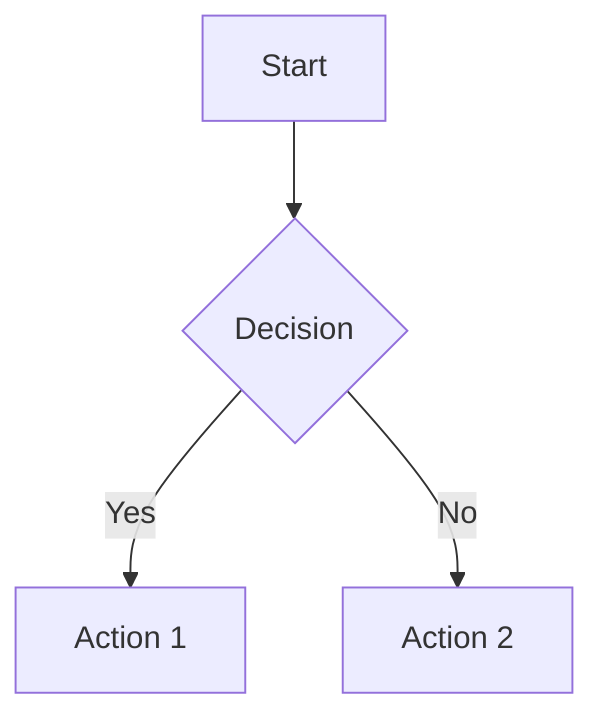

# Markdown 사용법 Cheatsheet

Markdown은 텍스트 기반의 마크업 언어로, 간단한 문법으로 문서를 작성할 수 있게 해주는 도구입니다. GitHub, GitLab, Notion, Obsidian 등 다양한 플랫폼에서 지원되며, 개발자와 기술 문서 작성자들에게 필수적인 도구입니다.

## 기본 문법

### 제목 (Headers)

```markdown
# H1 제목
## H2 제목
### H3 제목
#### H4 제목
##### H5 제목
###### H6 제목
```

**결과:**
# H1 제목
## H2 제목
### H3 제목
#### H4 제목
##### H5 제목
###### H6 제목

### 텍스트 스타일링

```markdown
**굵은 글씨** 또는 __굵은 글씨__
*기울임체* 또는 _기울임체_
~~취소선~~
`인라인 코드`
```

**결과:**
- **굵은 글씨** 또는 __굵은 글씨__
- *기울임체* 또는 _기울임체_
- ~~취소선~~
- `인라인 코드`

### 목록 (Lists)

#### 순서 없는 목록
```markdown
- 항목 1
- 항목 2
  - 하위 항목 2-1
  - 하위 항목 2-2
- 항목 3

* 또는 * 사용 가능
+ 또는 + 사용 가능
```

**결과:**
- 항목 1
- 항목 2
  - 하위 항목 2-1
  - 하위 항목 2-2
- 항목 3

#### 순서 있는 목록
```markdown
1. 첫 번째 항목
2. 두 번째 항목
3. 세 번째 항목
   1. 하위 항목 3-1
   2. 하위 항목 3-2
```

**결과:**
1. 첫 번째 항목
2. 두 번째 항목
3. 세 번째 항목
   1. 하위 항목 3-1
   2. 하위 항목 3-2

### 링크 (Links)

```markdown
[링크 텍스트](https://example.com)
[링크 텍스트](https://example.com "툴팁 텍스트")
[상대 링크](../folder/file.md)
[이메일 링크](mailto:example@email.com)
```

**결과:**
- [링크 텍스트](https://example.com)
- [링크 텍스트](https://example.com "툴팁 텍스트")
- [상대 링크](../folder/file.md)
- [이메일 링크](mailto:example@email.com)

### 이미지 (Images)

```markdown


```

### 인용문 (Blockquotes)

```markdown
> 이것은 인용문입니다.
> 
> 여러 줄의 인용문도 가능합니다.
> 
> > 중첩된 인용문도 가능합니다.
```

**결과:**
> 이것은 인용문입니다.
> 
> 여러 줄의 인용문도 가능합니다.
> 
> > 중첩된 인용문도 가능합니다.

### 코드 블록 (Code Blocks)

#### 인라인 코드
```markdown
`console.log('Hello World')` 같은 인라인 코드
```

#### 코드 블록
````markdown
```javascript
function hello() {
    console.log('Hello World');
}
```

```python
def hello():
    print("Hello World")
```

```html
<div class="container">
    <h1>Hello World</h1>
</div>
```
````

**결과:**
```javascript
function hello() {
    console.log('Hello World');
}
```

```python
def hello():
    print("Hello World")
```

```html
<div class="container">
    <h1>Hello World</h1>
</div>
```

### 테이블 (Tables)

```markdown
| 제목 1 | 제목 2 | 제목 3 |
|--------|--------|--------|
| 셀 1   | 셀 2   | 셀 3   |
| 셀 4   | 셀 5   | 셀 6   |

| 왼쪽 정렬 | 가운데 정렬 | 오른쪽 정렬 |
|:--------|:--------:|--------:|
| 왼쪽    | 가운데    | 오른쪽   |
```

**결과:**
| 제목 1 | 제목 2 | 제목 3 |
|--------|--------|--------|
| 셀 1   | 셀 2   | 셀 3   |
| 셀 4   | 셀 5   | 셀 6   |

| 왼쪽 정렬 | 가운데 정렬 | 오른쪽 정렬 |
|:--------|:--------:|--------:|
| 왼쪽    | 가운데    | 오른쪽   |

### 수평선 (Horizontal Rules)

```markdown
---
***
___
```

**결과:**
---
***
___

## 고급 문법

### 체크박스 (Task Lists)

```markdown
- [x] 완료된 작업
- [ ] 미완료 작업
- [x] 또 다른 완료된 작업
- [ ] 또 다른 미완료 작업
```

**결과:**
- [x] 완료된 작업
- [ ] 미완료 작업
- [x] 또 다른 완료된 작업
- [ ] 또 다른 미완료 작업

### 이스케이프 문자

```markdown
\*이스케이프된 별표\*
\#이스케이프된 해시\#
\[이스케이프된 대괄호\]
```

**결과:**
\*이스케이프된 별표\*
\#이스케이프된 해시\#
\[이스케이프된 대괄호\]

### HTML 태그 사용

```markdown
<details>
<summary>클릭하여 펼치기</summary>

이 내용은 접을 수 있습니다.

```javascript
console.log('접힌 코드 블록');
```
</details>
```

**결과:**
<details>
<summary>클릭하여 펼치기</summary>

이 내용은 접을 수 있습니다.

```javascript
console.log('접힌 코드 블록');
```
</details>

## 플랫폼별 확장 문법

### GitHub Flavored Markdown (GFM)

#### 테이블 정렬
```markdown
| 왼쪽 | 가운데 | 오른쪽 |
|:-----|:------:|------:|
| A    |   B    |     C  |
```

#### 자동 링크
```markdown
https://github.com
user@example.com
```

#### 취소선
```markdown
~~취소된 텍스트~~
```

#### 이모지
```markdown
:smile: :heart: :thumbsup:
```

### Notion 스타일

#### 토글 목록
```markdown
- [ ] 할 일 1
  - [x] 하위 할 일 1-1
  - [ ] 하위 할 일 1-2
- [x] 완료된 할 일
```

#### 코드 블록 언어 지정
````markdown

````

## 실전 활용 팁

### 1. 문서 구조화
```markdown
# 프로젝트 제목

## 개요
프로젝트에 대한 간단한 설명

## 설치 방법
1. 저장소 클론
2. 의존성 설치
3. 실행

## 사용법
### 기본 사용법
### 고급 사용법

## API 문서
| 메서드 | 설명 | 매개변수 |
|--------|------|----------|
| GET    | 조회 | id      |
| POST   | 생성 | data    |

## 라이선스
MIT License
```

### 2. README.md 작성 팁
- 프로젝트 제목과 설명을 명확히
- 설치 및 사용법을 단계별로 설명
- 스크린샷이나 GIF로 시각적 설명
- 기여 방법과 라이선스 정보 포함

### 3. 기술 문서 작성 팁
- 목차를 활용한 구조화
- 코드 예제는 실제 동작하는 것 사용
- 주석과 설명을 충분히 추가
- 버전 정보와 업데이트 날짜 기록

## 도구와 에디터

### 추천 에디터
- **Visual Studio Code**: Markdown 확장 기능 풍부
- **Typora**: 실시간 미리보기
- **Obsidian**: 노트 연결 기능
- **Notion**: 협업 기능
- **GitHub**: 웹 기반 편집

### VS Code 확장 프로그램
- Markdown All in One
- Markdown Preview Enhanced
- markdownlint
- Paste Image

### 온라인 도구
- [Dillinger](https://dillinger.io/): 온라인 Markdown 에디터
- [StackEdit](https://stackedit.io/): 고급 온라인 에디터
- [Markdown Live Preview](https://markdownlivepreview.com/): 실시간 미리보기

## 마크다운 변환 도구

### Pandoc
```bash
# HTML로 변환
pandoc input.md -o output.html

# PDF로 변환
pandoc input.md -o output.pdf

# Word 문서로 변환
pandoc input.md -o output.docx
```

### 기타 변환 도구
- **markdown-pdf**: Node.js 기반 PDF 변환
- **grip**: GitHub 스타일 미리보기
- **md2html**: 간단한 HTML 변환

## 결론

Markdown은 간단하면서도 강력한 문서 작성 도구입니다. 이 가이드를 참고하여 효율적인 문서 작성을 시작해보세요. 각 플랫폼의 특성을 고려하여 적절한 문법을 선택하고, 실무에서 꾸준히 사용하다 보면 자연스럽게 익숙해질 것입니다.

### 추가 학습 자료
- [Markdown 공식 가이드](https://daringfireball.net/projects/markdown/)
- [GitHub Flavored Markdown](https://github.github.com/gfm/)
- [CommonMark](https://commonmark.org/)
