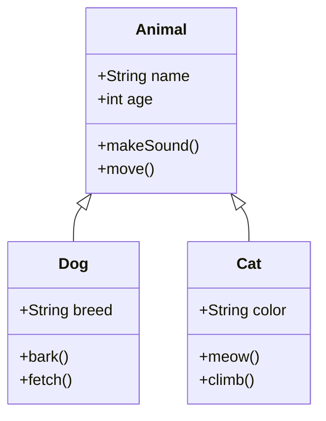

# Mermaid Class 다이어그램 사용법을 알아봅시다.

Class 다이어그램은 객체지향 프로그래밍에서 클래스와 그들 간의 관계를 표현하는 다이어그램입니다.

## 기본 Class Diagram

### 코드


### 렌더링된 다이어그램


classDiagram
    class Animal {
        +String name
        +int age
        +makeSound()
        +move()
    }
    
    class Dog {
        +String breed
        +bark()
        +fetch()
    }
    
    class Cat {
        +String color
        +meow()
        +climb()
    }
    
    Animal <|-- Dog
    Animal <|-- Cat


## 복잡한 Class Diagram 예제

### 코드
```mermaid
classDiagram
    class User {
        -String id
        -String username
        -String email
        -String password
        +login()
        +logout()
        +updateProfile()
    }
    
    class Post {
        -String id
        -String title
        -String content
        -Date createdAt
        -Date updatedAt
        +create()
        +update()
        +delete()
    }
    
    class Comment {
        -String id
        -String content
        -Date createdAt
        +add()
        +edit()
        +delete()
    }
    
    class Category {
        -String id
        -String name
        -String description
        +create()
        +update()
        +delete()
    }
    
    User ||--o{ Post : "creates"
    Post ||--o{ Comment : "has"
    User ||--o{ Comment : "writes"
    Category ||--o{ Post : "contains"
```

### 렌더링된 다이어그램


classDiagram
    class User {
        -String id
        -String username
        -String email
        -String password
        +login()
        +logout()
        +updateProfile()
    }
    
    class Post {
        -String id
        -String title
        -String content
        -Date createdAt
        -Date updatedAt
        +create()
        +update()
        +delete()
    }
    
    class Comment {
        -String id
        -String content
        -Date createdAt
        +add()
        +edit()
        +delete()
    }
    
    class Category {
        -String id
        -String name
        -String description
        +create()
        +update()
        +delete()
    }
    
    %% 관계 정의
    User --> Post
    Post --> Comment
    User --> Comment
    Category --> Post


## Class Diagram 문법 요약

- `classDiagram`: 클래스 다이어그램 시작
- `class 클래스명 { ... }`: 클래스 정의
- `+속성/메서드`: public (공개)
- `-속성/메서드`: private (비공개)
- `#속성/메서드`: protected (보호)
- `<|--`: 상속 관계
- `||--o{`: 일대다 관계
- `||--||`: 일대일 관계
