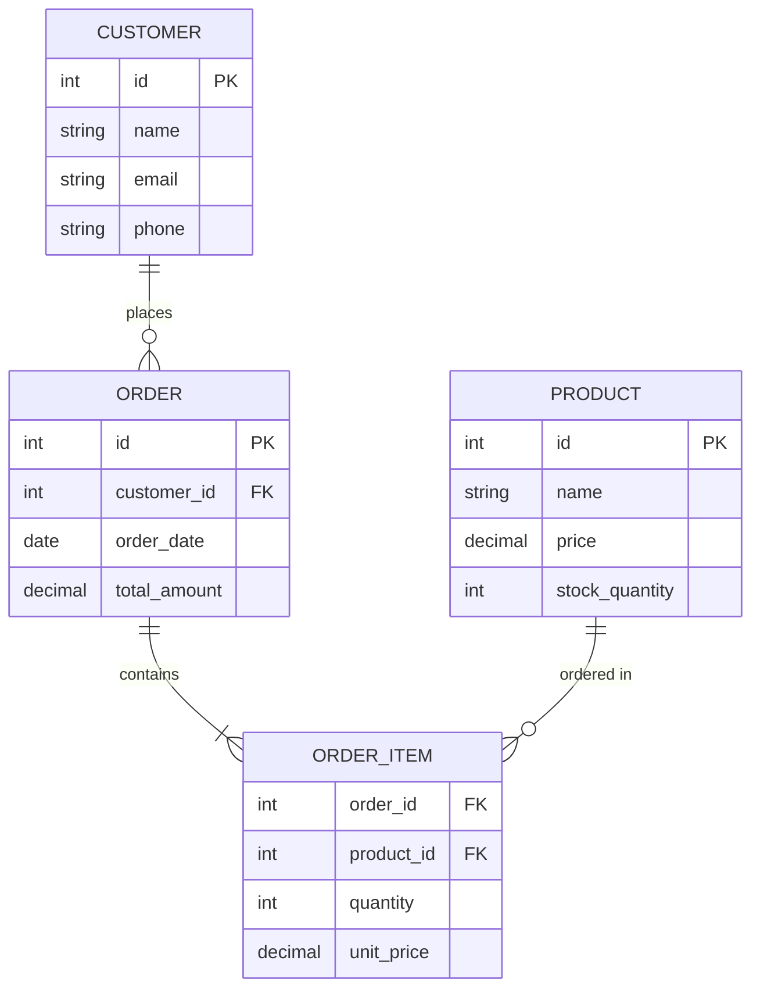

# Mermaid ER 다이어그램 사용법을 알아봅시다.

ER(Entity-Relationship) 다이어그램은 데이터베이스의 엔티티와 그들 간의 관계를 표현하는 다이어그램입니다.

## 기본 ER Diagram

### 코드

### 렌더링된 다이어그램


erDiagram
    CUSTOMER ||--o{ ORDER : places
    ORDER ||--|{ ORDER_ITEM : contains
    PRODUCT ||--o{ ORDER_ITEM : "ordered in"
    
    CUSTOMER {
        int id PK
        string name
        string email
        string phone
    }
    
    ORDER {
        int id PK
        int customer_id FK
        date order_date
        decimal total_amount
    }
    
    PRODUCT {
        int id PK
        string name
        decimal price
        int stock_quantity
    }
    
    ORDER_ITEM {
        int order_id FK
        int product_id FK
        int quantity
        decimal unit_price
    }


## 복잡한 ER Diagram 예제

### 코드

### 렌더링된 다이어그램


erDiagram
    USER ||--o{ POST : creates
    USER ||--o{ COMMENT : writes
    POST ||--o{ COMMENT : has
    POST ||--o{ POST_TAG : tagged
    TAG ||--o{ POST_TAG : "tagged in"
    CATEGORY ||--o{ POST : belongs_to
    
    USER {
        int id PK
        string username
        string email
        string password_hash
        datetime created_at
        datetime updated_at
        boolean is_active
    }
    
    POST {
        int id PK
        int user_id FK
        int category_id FK
        string title
        text content
        string slug
        datetime created_at
        datetime updated_at
        boolean is_published
    }
    
    COMMENT {
        int id PK
        int user_id FK
        int post_id FK
        int parent_id FK
        text content
        datetime created_at
        datetime updated_at
        boolean is_approved
    }
    
    CATEGORY {
        int id PK
        string name
        string slug
        text description
        datetime created_at
    }
    
    TAG {
        int id PK
        string name
        string slug
        datetime created_at
    }
    
    POST_TAG {
        int post_id FK
        int tag_id FK
        datetime created_at
    }


## ER Diagram 문법 요약

- `erDiagram`: ER 다이어그램 시작
- `엔티티1 ||--o{ 엔티티2 : 관계명`: 일대다 관계
- `엔티티1 ||--|| 엔티티2 : 관계명`: 일대일 관계
- `엔티티1 }o--o{ 엔티티2 : 관계명`: 다대다 관계
- `PK`: Primary Key (기본키)
- `FK`: Foreign Key (외래키)
