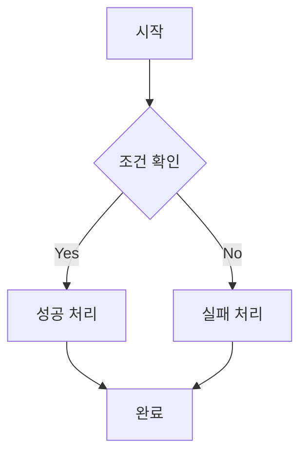
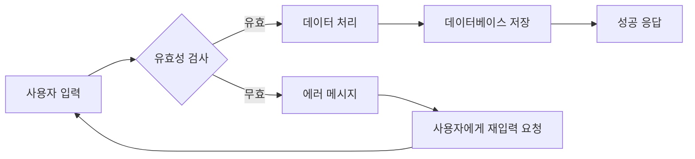

# Mermaid Flowchart 다이어그램 사용법을 알아봅시다.

Flowchart는 프로세스나 워크플로우를 시각적으로 표현하는 다이어그램입니다.

## 기본 Flowchart

### 코드

### 렌더링된 다이어그램


flowchart TD
    A[시작] --> B{조건 확인}
    B -->|Yes| C[성공 처리]
    B -->|No| D[실패 처리]
    C --> E[완료]
    D --> E


## 복잡한 Flowchart 예제

### 코드

### 렌더링된 다이어그램


flowchart LR
    A[사용자 입력] --> B{유효성 검사}
    B -->|유효| C[데이터 처리]
    B -->|무효| D[에러 메시지]
    C --> E[데이터베이스 저장]
    E --> F[성공 응답]
    D --> G[사용자에게 재입력 요청]
    G --> A


## Flowchart 문법 요약

- `flowchart TD`: Top Down 방향
- `flowchart LR`: Left to Right 방향
- `[텍스트]`: 사각형 노드
- `{텍스트}`: 다이아몬드 노드 (조건)
- `-->`: 화살표 연결
- `|라벨|`: 화살표에 라벨 추가
