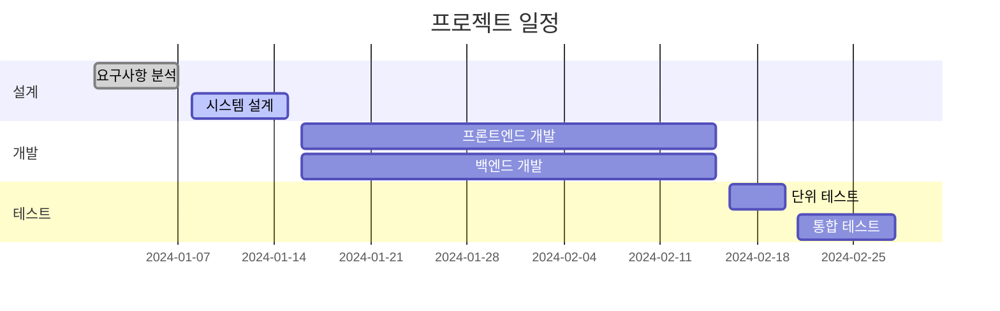
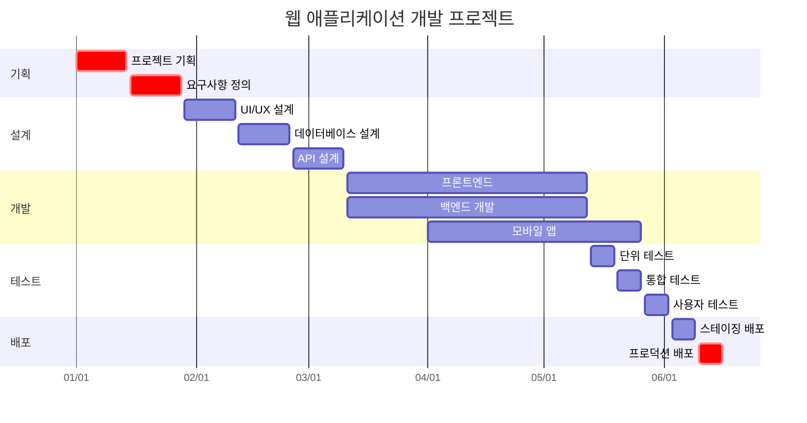

# Mermaid Gantt 다이어그램 사용법을 알아봅시다.

Gantt 차트는 프로젝트의 작업 일정을 시각적으로 표현하는 다이어그램입니다.

## 기본 Gantt Chart

### 코드

### 렌더링된 다이어그램


gantt
    title 프로젝트 일정
    dateFormat  YYYY-MM-DD
    section 설계
    요구사항 분석    :done,    des1, 2024-01-01, 2024-01-07
    시스템 설계      :active,  des2, 2024-01-08, 2024-01-15
    section 개발
    프론트엔드 개발  :         dev1, 2024-01-16, 2024-02-15
    백엔드 개발      :         dev2, 2024-01-16, 2024-02-15
    section 테스트
    단위 테스트      :         test1, 2024-02-16, 2024-02-20
    통합 테스트      :         test2, 2024-02-21, 2024-02-28


## 복잡한 Gantt Chart 예제

### 코드

### 렌더링된 다이어그램


gantt
    title 웹 애플리케이션 개발 프로젝트
    dateFormat  YYYY-MM-DD
    axisFormat  %m/%d
    
    section 기획
    프로젝트 기획    :crit,    plan1, 2024-01-01, 2024-01-14
    요구사항 정의    :crit,    plan2, 2024-01-15, 2024-01-28
    
    section 설계
    UI/UX 설계      :         design1, 2024-01-29, 2024-02-11
    데이터베이스 설계 :         design2, 2024-02-12, 2024-02-25
    API 설계        :         design3, 2024-02-26, 2024-03-10
    
    section 개발
    프론트엔드       :         frontend, 2024-03-11, 2024-05-12
    백엔드 개발      :         backend, 2024-03-11, 2024-05-12
    모바일 앱        :         mobile, 2024-04-01, 2024-05-26
    
    section 테스트
    단위 테스트      :         unit, 2024-05-13, 2024-05-19
    통합 테스트      :         integration, 2024-05-20, 2024-05-26
    사용자 테스트    :         uat, 2024-05-27, 2024-06-02
    
    section 배포
    스테이징 배포    :         staging, 2024-06-03, 2024-06-09
    프로덕션 배포    :crit,    production, 2024-06-10, 2024-06-16


## Gantt Chart 문법 요약

- `gantt`: 간트 차트 시작
- `title 제목`: 차트 제목
- `dateFormat YYYY-MM-DD`: 날짜 형식
- `section 섹션명`: 작업 그룹
- `작업명 :상태, ID, 시작일, 종료일`: 작업 정의
- `:done`: 완료된 작업
- `:active`: 진행 중인 작업
- `:crit`: 중요한 작업
