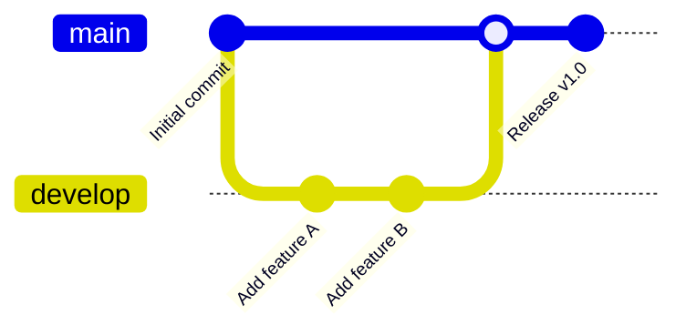
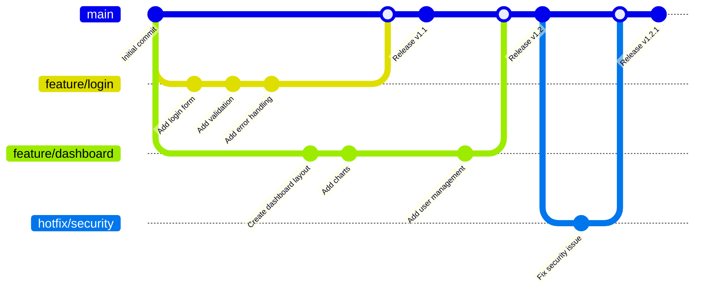

# Mermaid Git Graph 다이어그램 사용법을 알아봅시다.

Git Graph는 Git 브랜치와 커밋 히스토리를 시각적으로 표현하는 다이어그램입니다.

## 기본 Git Graph

### 코드

### 렌더링된 다이어그램


gitGraph
    commit id: "Initial commit"
    branch develop
    checkout develop
    commit id: "Add feature A"
    commit id: "Add feature B"
    checkout main
    merge develop
    commit id: "Release v1.0"


## 복잡한 Git Graph 예제

### 코드

### 렌더링된 다이어그램


gitGraph
    commit id: "Initial commit"
    branch feature/login
    checkout feature/login
    commit id: "Add login form"
    commit id: "Add validation"
    commit id: "Add error handling"
    
    checkout main
    branch feature/dashboard
    checkout feature/dashboard
    commit id: "Create dashboard layout"
    commit id: "Add charts"
    
    checkout main
    merge feature/login
    commit id: "Release v1.1"
    
    checkout feature/dashboard
    commit id: "Add user management"
    
    checkout main
    merge feature/dashboard
    commit id: "Release v1.2"
    
    branch hotfix/security
    checkout hotfix/security
    commit id: "Fix security issue"
    
    checkout main
    merge hotfix/security
    commit id: "Release v1.2.1"


## Git Graph 문법 요약

- `gitGraph`: Git 그래프 시작
- `commit id: "메시지"`: 커밋 생성
- `branch 브랜치명`: 새 브랜치 생성
- `checkout 브랜치명`: 브랜치 전환
- `merge 브랜치명`: 브랜치 병합
- `cherry-pick 커밋ID`: 커밋 선택적 적용
