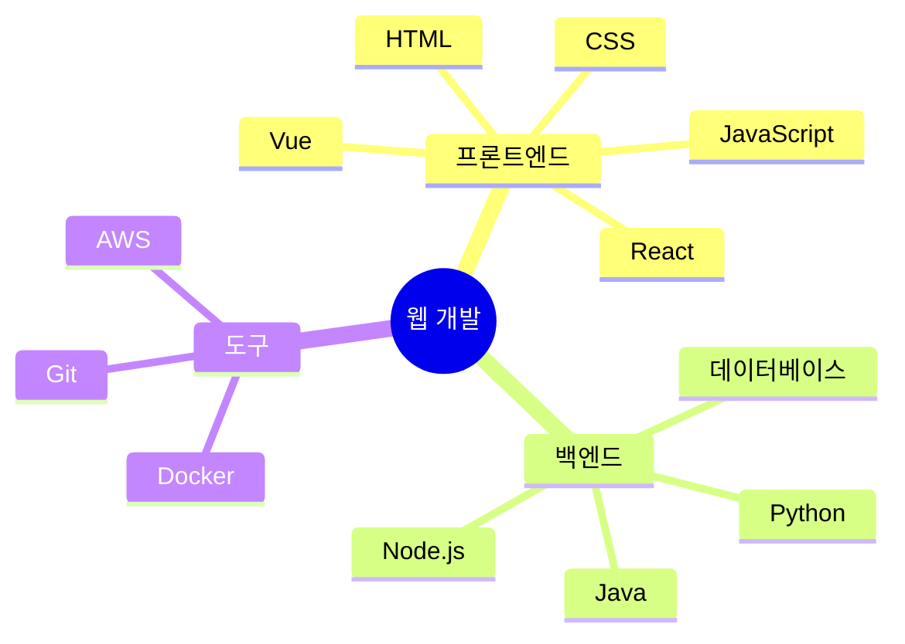
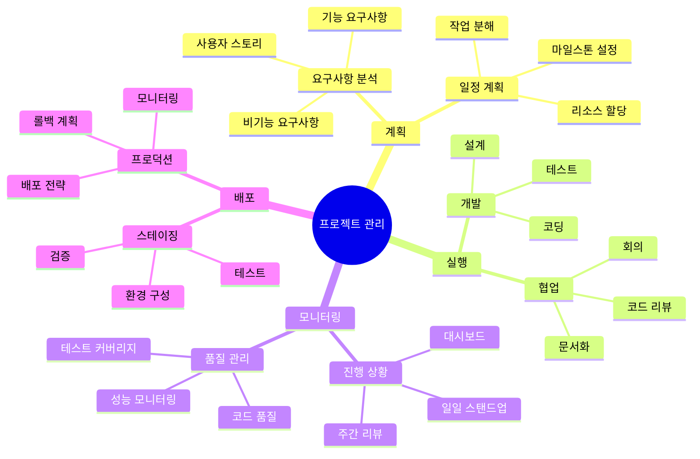

# Mermaid Mindmap 다이어그램 사용법을 알아봅시다.

Mindmap은 중심 주제에서 시작하여 관련 아이디어들을 가지처럼 확장해 나가는 다이어그램입니다.

## 기본 Mindmap

### 코드

### 렌더링된 다이어그램


mindmap
  root((웹 개발))
    프론트엔드
      HTML
      CSS
      JavaScript
      React
      Vue
    백엔드
      Node.js
      Python
      Java
      데이터베이스
    도구
      Git
      Docker
      AWS


## 복잡한 Mindmap 예제

### 코드

### 렌더링된 다이어그램


mindmap
  root((프로젝트 관리))
    계획
      요구사항 분석
        기능 요구사항
        비기능 요구사항
        사용자 스토리
      일정 계획
        마일스톤 설정
        작업 분해
        리소스 할당
    실행
      개발
        설계
        코딩
        테스트
      협업
        코드 리뷰
        회의
        문서화
    모니터링
      진행 상황
        일일 스탠드업
        주간 리뷰
        대시보드
      품질 관리
        코드 품질
        테스트 커버리지
        성능 모니터링
    배포
      스테이징
        환경 구성
        테스트
        검증
      프로덕션
        배포 전략
        롤백 계획
        모니터링


## Mindmap 문법 요약

- `mindmap`: 마인드맵 시작
- `root((중심주제))`: 중심 주제 정의
- 들여쓰기로 계층 구조 표현
- 각 레벨은 2칸 들여쓰기
- 아이콘 사용 가능: `((아이콘))`
