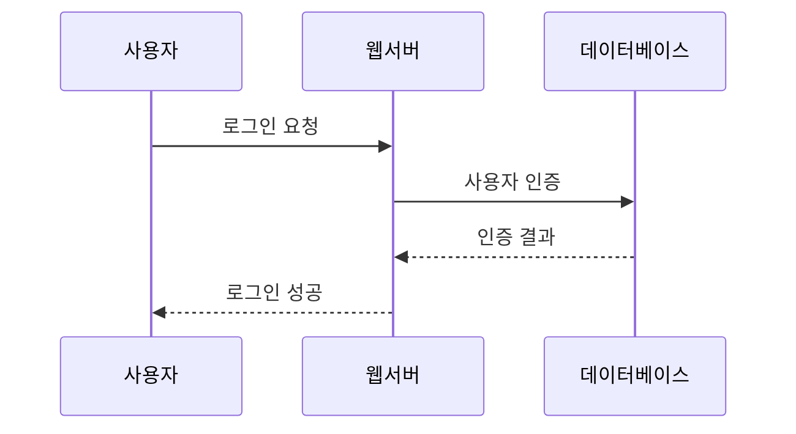
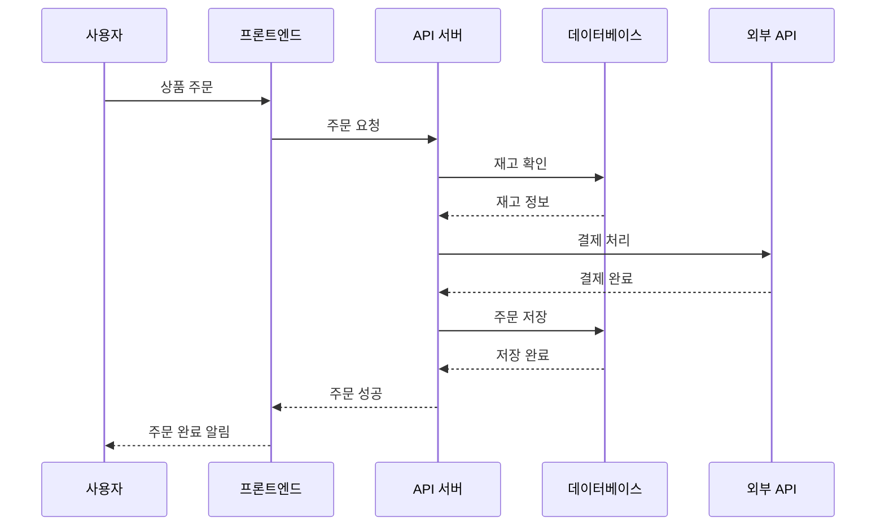

# Mermaid Sequence 다이어그램 사용법을 알아봅시다.

Sequence 다이어그램은 시스템 간의 상호작용을 시간 순서대로 보여주는 다이어그램입니다.

## 기본 Sequence Diagram

### 코드

### 렌더링된 다이어그램


sequenceDiagram
    participant A as 사용자
    participant B as 웹서버
    participant C as 데이터베이스
    
    A->>B: 로그인 요청
    B->>C: 사용자 인증
    C-->>B: 인증 결과
    B-->>A: 로그인 성공


## 복잡한 Sequence Diagram 예제

### 코드

### 렌더링된 다이어그램


sequenceDiagram
    participant U as 사용자
    participant F as 프론트엔드
    participant A as API 서버
    participant D as 데이터베이스
    participant E as 외부 API
    
    U->>F: 상품 주문
    F->>A: 주문 요청
    A->>D: 재고 확인
    D-->>A: 재고 정보
    A->>E: 결제 처리
    E-->>A: 결제 완료
    A->>D: 주문 저장
    D-->>A: 저장 완료
    A-->>F: 주문 성공
    F-->>U: 주문 완료 알림


## Sequence Diagram 문법 요약

- `sequenceDiagram`: 시퀀스 다이어그램 시작
- `participant A as 이름`: 참여자 정의
- `A->>B`: 실선 화살표 (요청)
- `A-->>B`: 점선 화살표 (응답)
- `A->>+B`: 활성화 시작
- `A->>-B`: 활성화 종료
