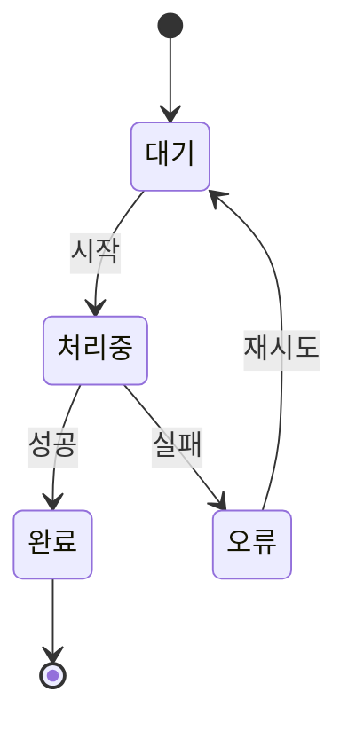
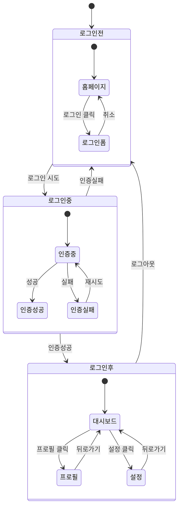

# Mermaid State 다이어그램 사용법을 알아봅시다.

State 다이어그램은 시스템이나 객체의 상태 변화를 표현하는 다이어그램입니다.

## 기본 State Diagram

### 코드

### 렌더링된 다이어그램


stateDiagram-v2
    [*] --> 대기
    대기 --> 처리중 : 시작
    처리중 --> 완료 : 성공
    처리중 --> 오류 : 실패
    오류 --> 대기 : 재시도
    완료 --> [*]


## 복잡한 State Diagram 예제

### 코드

### 렌더링된 다이어그램


stateDiagram-v2
    [*] --> 로그인전
    
    state 로그인전 {
        [*] --> 홈페이지
        홈페이지 --> 로그인폼 : 로그인 클릭
        로그인폼 --> 홈페이지 : 취소
    }
    
    state 로그인중 {
        [*] --> 인증중
        인증중 --> 인증성공 : 성공
        인증중 --> 인증실패 : 실패
        인증실패 --> 인증중 : 재시도
    }
    
    state 로그인후 {
        [*] --> 대시보드
        대시보드 --> 프로필 : 프로필 클릭
        대시보드 --> 설정 : 설정 클릭
        프로필 --> 대시보드 : 뒤로가기
        설정 --> 대시보드 : 뒤로가기
    }
    
    로그인전 --> 로그인중 : 로그인 시도
    로그인중 --> 로그인후 : 인증성공
    로그인중 --> 로그인전 : 인증실패
    로그인후 --> 로그인전 : 로그아웃


## State Diagram 문법 요약

- `stateDiagram-v2`: 상태 다이어그램 시작
- `[*]`: 초기/최종 상태
- `상태1 --> 상태2 : 이벤트`: 상태 전환
- `state 복합상태 { ... }`: 복합 상태 정의
- `note right of 상태 : 메모`: 상태에 메모 추가
